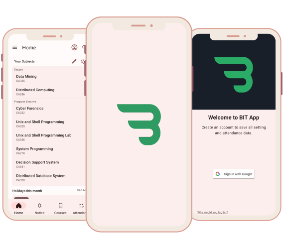

# Welcome to BIT APP

{ loading=lazy height=200px style="display: block; margin: 0 auto" }

<!-- { loading=lazy height=200px style="display: block; margin: 0 auto" } -->

`Simple and easy to use app for BIT students.`

This app contains the Bit Lalpur syllabus for `UG` and `PG` programs. It also has an integrated ERP
cell, so you won't have to go to your browsers. It also includes many other tools, such as an
attendance manager and a CGPA calculator, to assist you in keeping track of your attendance and
avoiding f stars. For your convenience, the notice section contains notices based on Bit Mesra's
website and the holiday list. We've also included a society section in the app so you can connect
with them and participate
in their events.

## Current Version

    - Stable: {{ version.stable }}
    - Pre-release : {{ version.pre_release }}

- For Stable version, download
  from [Playstore](https://play.google.com/store/apps/details?id=com.atech.bit){ target="\_blank"}
- For Beta version, download from [Github](https://github.com/BIT-Lalpur-App/BIT-App/releases)

<!--
[{ width="200" }](https://play.google.com/store/apps/details?id=com.atech.bit){ target="_blank"} -->

## Features

- **ERP Integration:** Swift access for efficient task and data management.
- **Syllabus Overview:** Easily browse your academic syllabus for course details.

- **Customizable Home Screen:** Personalize for a user-centric and intuitive experience.

- **Real-time Notifications:** Stay informed with the latest news and events.

- **Academic Management:** Track attendance and manage SGPA effortlessly.

- **Cloud Backup:** Secure your data with easy cloud backup options.

- **Material 3 Theming:** Choose from light and dark modes for a tailored look.

- **Chat Bot (Beta):** Quick access to information with our innovative chat bot.

## Team

<div class="grid cards" markdown>

- :material-code-json: **Ayaan** : Main Developer
- :material-developer-board: **Nilay** : Developer
- :fontawesome-solid-computer: **Brishti** : App Manager
- :simple-googletagmanager: **Piyush** : Manager

</div>

## Tech Stack

<div class="grid cards" markdown>

- **Language:** :simple-kotlin: Kotlin
- **UI:** :material-material-design: Material Design 3
- **Database:** :simple-firebase: Firebase
- **Architecture:** :fontawesome-regular-building: MVVM
- **Dependency Injection:** :simple-dependencycheck: Hilt
- **Network:** :material-network: Retrofit
- **Image Loading:** :material-loading: Coil (Formerly Glide)
- **Analytics:** :simple-firebase: Firebase

</div>

## License

```

Copyright (c) 2021 Ayaan

Permission is hereby granted, free of charge, to any person obtaining a copy
of this software and associated documentation files (the "Software"), to deal
in the Software without restriction, including without limitation the rights
to use, copy, modify, merge, publish, distribute, sublicense, and/or sell
copies of the Software, and to permit persons to whom the Software is
furnished to do so, subject to the following conditions:

The above copyright notice and this permission notice shall be included in all
copies or substantial portions of the Software.

THE SOFTWARE IS PROVIDED "AS IS", WITHOUT WARRANTY OF ANY KIND, EXPRESS OR
IMPLIED, INCLUDING BUT NOT LIMITED TO THE WARRANTIES OF MERCHANTABILITY,
FITNESS FOR A PARTICULAR PURPOSE AND NONINFRINGEMENT. IN NO EVENT SHALL THE
AUTHORS OR COPYRIGHT HOLDERS BE LIABLE FOR ANY CLAIM, DAMAGES OR OTHER
LIABILITY, WHETHER IN AN ACTION OF CONTRACT, TORT OR OTHERWISE, ARISING FROM,
OUT OF OR IN CONNECTION WITH THE SOFTWARE OR THE USE OR OTHER DEALINGS IN THE
SOFTWARE.
```